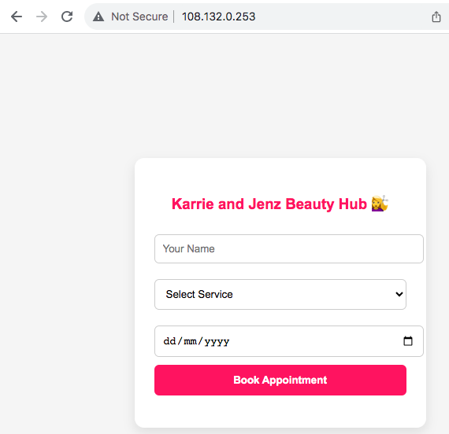
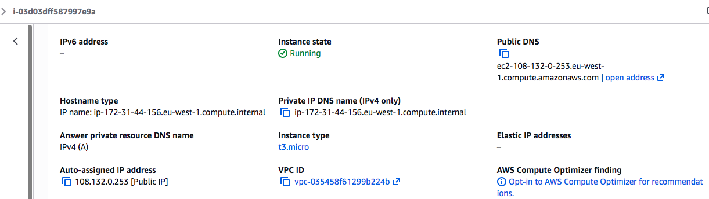
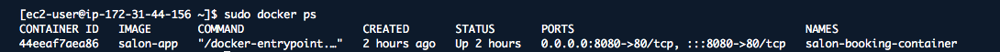
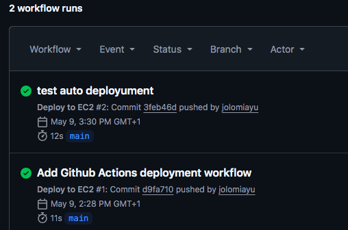
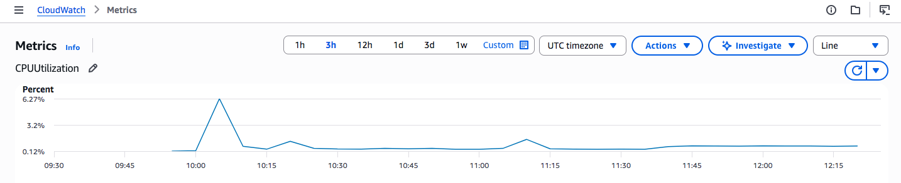

# AWS Salon Booking Platform 💇‍♀️☁️

A cloud-based salon booking platform deployed on AWS using a hybrid architecture combining serverless services and EC2 infrastructure.

---

# 🚀 Live Deployment

Frontend hosted on AWS EC2 with Nginx and Docker.

---

# 🧠 Architecture

EC2 Frontend
→ API Gateway
→ AWS Lambda
→ DynamoDB
→ SNS Notifications

---

# ☁️ AWS Services Used

- EC2
- Lambda
- API Gateway
- DynamoDB
- SNS
- Cognito
- CloudWatch

---

# 🐳 DevOps & Infrastructure

- Docker
- Docker Compose
- GitHub Actions
- CI/CD Deployment
- Nginx
- Linux (Amazon Linux 2023)
- SSH

---

# 🔄 CI/CD Workflow

GitHub Actions automatically deploys updates to the EC2 server after pushing changes to the main branch.

---

# 📊 Monitoring

CloudWatch Agent was configured for EC2 monitoring and log collection.

---

# 📸 Project Screenshots

## Live Application

---

## EC2 Infrastructure

---

## Docker Container Running

---

## GitHub Actions CI/CD

---

## CloudWatch Monitoring

---

# 🎯 Skills Demonstrated

- AWS Cloud Engineering
- DevOps Fundamentals
- Linux Administration
- Containerization
- CI/CD Pipelines
- Infrastructure Monitoring
- Serverless Architecture
- Git & GitHub Workflows
